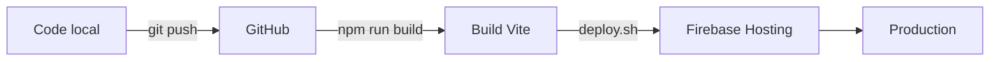

# Documentation Technique - Waltera

**Version:** 1.0.0
**Date:** 11 janvier 2026
**Projet:** Assistant IA pour Conseil RH

---

## 📋 Table des matières

1. [Vue d'ensemble](#vue-densemble)
2. [Stack Technique](#stack-technique)
3. [Environnements](#environnements)
4. [Architecture](#architecture)
5. [Base de données](#base-de-données)
6. [Déploiement](#déploiement)
7. [Configuration](#configuration)
8. [Sécurité](#sécurité)
9. [Liens utiles](#liens-utiles)

---

## 🎯 Vue d'ensemble

**Waltera** est une application web moderne d'assistance IA pour le conseil RH, permettant :
- La consultation de contrats clients via RAG (Retrieval Augmented Generation)
- L'accès aux conventions collectives nationales (CCN)
- L'analyse et l'optimisation de l'organisation documentaire
- Le calcul de tarifs de complémentaire santé

### Contexte
Migration depuis base44.com vers une stack locale Supabase avec hébergement Firebase.

---

## 🛠️ Stack Technique

### Frontend

| Technologie | Version | Usage |
|-------------|---------|-------|
| **React** | 18.2.0 | Framework UI principal |
| **TypeScript** | 5.6.3 | Typage statique |
| **Vite** | 6.1.0 | Build tool & dev server |
| **React Router** | 7.2.0 | Navigation SPA |
| **Tailwind CSS** | 3.4.17 | Framework CSS utility-first |
| **Framer Motion** | 12.4.7 | Animations |

### UI Components

| Bibliothèque | Description |
|--------------|-------------|
| **shadcn/ui** | Composants UI basés sur Radix UI |
| **Radix UI** | Primitives UI accessibles (40+ packages) |
| **Lucide React** | 0.475.0 - Icônes |
| **Recharts** | 2.15.1 - Graphiques |
| **Sonner** | 2.0.7 - Toast notifications |

### Backend & Services

| Service | Usage |
|---------|-------|
| **Supabase** | Base de données PostgreSQL, Auth, Storage, Realtime |
| **@supabase/supabase-js** | 2.39.0 - Client SDK |
| **Firebase Hosting** | Hébergement statique |

### Forms & Validation

| Package | Version |
|---------|---------|
| **React Hook Form** | 7.54.2 |
| **Zod** | 3.24.2 |
| **@hookform/resolvers** | 4.1.2 |

### Utilitaires

| Package | Usage |
|---------|-------|
| **date-fns** | 3.6.0 - Manipulation de dates |
| **clsx** | 2.1.1 - Utilitaire classes CSS |
| **tailwind-merge** | 3.0.2 - Fusion classes Tailwind |
| **class-variance-authority** | 0.7.1 - Variants de composants |
| **xlsx** | 0.18.5 - Import/export Excel |

### Testing

| Package | Version |
|---------|---------|
| **Vitest** | 4.0.14 |
| **@vitest/ui** | 4.0.14 |

---

## 🌍 Environnements

### Aperçu

Le projet est configuré pour **3 environnements** avec un workflow Git et Firebase :

| Environnement | Branche Git | Projet Firebase | URL | Status |
|---------------|-------------|-----------------|-----|--------|
| **Production** | `main` | `waltera-7240c` | https://waltera-7240c.web.app | ✅ Configuré |
| **Staging** | - | - | - | ⚠️ Non configuré |
| **Development** | - | - | - | ⚠️ Non configuré |

### Configuration actuelle

#### Git Repository
```
URL: git@github.com:jbGared/Waltera.git
Branche principale: main
Branche actuelle: main
```

#### Firebase
```json
{
  "projects": {
    "default": "waltera-7240c"
  }
}
```

**Projet Firebase configuré:**
- ID: `waltera-7240c`
- Hosting: Activé (dossier `dist/`)
- URL Production: https://waltera-7240c.web.app

⚠️ **Note:** Les environnements staging et dev Firebase ne sont pas encore créés dans `.firebaserc`.

#### Supabase

**Projet Production:**
- URL: `https://syxsacbciqwrahjdixuc.supabase.co`
- Project ID: `syxsacbciqwrahjdixuc`
- Région: Non spécifiée (probablement EU)

**Configuration client:**
```typescript
// src/integrations/supabase/client.ts
const supabaseUrl = import.meta.env.VITE_SUPABASE_URL
const supabaseAnonKey = import.meta.env.VITE_SUPABASE_ANON_KEY
```

### Variables d'environnement

#### Fichiers
- `.env.example` - Template des variables
- `.env` - Variables actuelles (git ignored)
- `.env.local` - Variables locales (git ignored)

#### Variables requises

```env
# Supabase
VITE_SUPABASE_URL=https://syxsacbciqwrahjdixuc.supabase.co
VITE_SUPABASE_ANON_KEY=eyJhbGc...

# Environnements futurs (à créer)
# VITE_APP_ENV=dev|staging|prod
# VITE_GOOGLE_CLIENT_ID=xxx
# VITE_MICROSOFT_CLIENT_ID=xxx
```

---

## 🏗️ Architecture

### Structure du projet

```
waltera/
├── src/
│   ├── components/              # Composants React
│   │   ├── ui/                 # shadcn/ui components
│   │   │   ├── button.tsx
│   │   │   ├── card.tsx
│   │   │   ├── dialog.tsx
│   │   │   ├── input.tsx
│   │   │   ├── select.tsx
│   │   │   ├── scroll-area.tsx
│   │   │   ├── separator.tsx
│   │   │   └── ... (40+ composants)
│   │   ├── chat/               # Composants chat
│   │   │   ├── AnimatedW.tsx
│   │   │   ├── ArchivedConversationsList.tsx
│   │   │   ├── ChatContent.tsx
│   │   │   ├── ConversationsList.tsx
│   │   │   ├── LinkPreviewCard.tsx
│   │   │   ├── MessageBubble.tsx
│   │   │   └── ServiceIcon.tsx
│   │   └── ccn/                # Gestion CCN
│   │       ├── CcnAvailableList.tsx
│   │       ├── CcnImportManager.tsx
│   │       ├── CcnImportedList.tsx
│   │       └── CcnSettings.tsx
│   ├── pages/                  # Pages de l'application
│   │   ├── index.tsx           # Page d'accueil
│   │   ├── CCN.tsx            # Page conventions collectives
│   │   ├── CcnManagement.tsx  # Gestion CCN
│   │   ├── ChatContrats.tsx   # Chat contrats clients
│   │   └── ChatConventions.tsx # Chat conventions
│   ├── hooks/                  # Custom hooks
│   │   ├── useAuth.ts
│   │   ├── useProfile.ts
│   │   ├── useConversations.ts
│   │   ├── useChat.ts
│   │   ├── useChatWithHistory.ts
│   │   ├── useChatWithStreaming.ts
│   │   ├── useCcnImport.ts
│   │   └── use-toast.ts
│   ├── services/               # Services métier
│   │   ├── profiles.ts
│   │   ├── devis.ts
│   │   ├── ccnService.ts
│   │   └── tarificateur/       # Module tarificateur santé
│   │       ├── calculator.ts
│   │       ├── calculatorSupabase.ts
│   │       ├── supabase.ts
│   │       ├── types.ts
│   │       ├── utils.ts
│   │       ├── validator.ts
│   │       └── *.test.ts
│   ├── integrations/           # Intégrations externes
│   │   └── supabase/
│   │       ├── client.ts       # Client Supabase configuré
│   │       ├── types.ts        # Types générés de la DB
│   │       ├── index.ts
│   │       └── helpers.ts
│   ├── lib/                    # Utilitaires
│   │   └── utils.ts
│   ├── types/                  # Types TypeScript
│   │   └── mapping.ts
│   ├── constants/              # Constantes
│   │   └── index.ts
│   └── utils/                  # Fonctions utilitaires
│       └── index.ts
├── public/                     # Assets statiques
│   └── data/                   # Données statiques
├── .env.example                # Template environnement
├── .env                        # Variables environnement (ignored)
├── .env.local                  # Variables locales (ignored)
├── .firebaserc                 # Config Firebase
├── firebase.json               # Config hosting Firebase
├── deploy.sh                   # Script de déploiement
├── vite.config.ts             # Configuration Vite
├── tsconfig.json              # Configuration TypeScript
├── tailwind.config.js         # Configuration Tailwind
├── package.json               # Dépendances
├── CLAUDE.md                  # Instructions projet (général)
├── waltera/CLAUDE.md          # Instructions tarificateur
└── README.md                  # Documentation
```

### Configuration Vite

**Optimisations de build:**
```typescript
// vite.config.ts
{
  server: { host: true, port: 5173 },
  resolve: { alias: { '@': './src' } },
  build: {
    rollupOptions: {
      output: {
        manualChunks: {
          'react-vendor': ['react', 'react-dom', 'react-router-dom'],
          'ui-vendor': ['@radix-ui/...'],
          'form-vendor': ['react-hook-form', 'zod'],
          'supabase-vendor': ['@supabase/supabase-js'],
          'viz-vendor': ['recharts', 'framer-motion']
        }
      }
    },
    chunkSizeWarningLimit: 600
  }
}
```

### Configuration TypeScript

```json
{
  "target": "ES2020",
  "lib": ["ES2020", "DOM", "DOM.Iterable"],
  "module": "ESNext",
  "moduleResolution": "bundler",
  "strict": true,
  "paths": {
    "@/*": ["./src/*"]
  }
}
```

---

## 🗄️ Base de données

### Supabase PostgreSQL

**Schéma:** `public`
**Total tables:** 18
**Row Level Security:** Activé sur la plupart des tables

### Tables principales

#### 1. **profiles** (3 lignes)
```sql
CREATE TABLE profiles (
  id UUID PRIMARY KEY,
  email TEXT UNIQUE NOT NULL,
  first_name TEXT,
  last_name TEXT,
  role TEXT,
  phone TEXT,
  address TEXT,
  city TEXT,
  postal_code TEXT,
  is_admin BOOLEAN DEFAULT false,
  avatar_url TEXT,
  created_at TIMESTAMPTZ DEFAULT now(),
  updated_at TIMESTAMPTZ DEFAULT now()
);
```
**RLS:** ✅ Activé
**Relations:** `profiles.id` → `auth.users.id`

#### 2. **documents** (234 161 lignes) 📊
```sql
CREATE TABLE documents (
  id BIGSERIAL PRIMARY KEY,
  content TEXT,
  metadata JSONB,
  embedding VECTOR,
  created_at TIMESTAMPTZ DEFAULT now(),
  updated_at TIMESTAMPTZ DEFAULT now(),
  is_deleted BOOLEAN DEFAULT false
);
```
**RLS:** ✅ Activé
**Usage:** Stockage des chunks de documents avec embeddings pour RAG

#### 3. **document_metadata** (0 lignes)
```sql
CREATE TABLE document_metadata (
  id TEXT PRIMARY KEY,
  file_path TEXT,
  file_name TEXT,
  client_name TEXT,
  client_id UUID REFERENCES clients(id),
  document_type TEXT,
  category TEXT,
  is_contract BOOLEAN,
  ccn_idcc TEXT[],
  idcc TEXT REFERENCES idcc_ref(idcc),
  effective_date DATE,
  size_bytes BIGINT,
  mtime TIMESTAMPTZ,
  source_type TEXT DEFAULT 'nas' CHECK (source_type IN ('nas', 'ccn')),
  created_at TIMESTAMPTZ DEFAULT now(),
  updated_at TIMESTAMPTZ DEFAULT now()
);
```
**RLS:** ✅ Activé

#### 4. **conversations** (30 lignes)
```sql
CREATE TABLE conversations (
  id UUID PRIMARY KEY DEFAULT uuid_generate_v4(),
  user_id UUID REFERENCES auth.users(id),
  title TEXT DEFAULT 'Nouvelle conversation',
  session_id TEXT UNIQUE,
  service_type service_type DEFAULT 'rag_contrats',
  status conversation_status DEFAULT 'active',
  messages JSONB DEFAULT '[]',
  metadata JSONB DEFAULT '{}',
  created_at TIMESTAMPTZ DEFAULT now(),
  updated_at TIMESTAMPTZ DEFAULT now(),
  last_message_at TIMESTAMPTZ DEFAULT now(),
  message_count INTEGER DEFAULT 0
);
```
**RLS:** ✅ Activé
**Types ENUM:**
- `service_type`: 'rag_contrats', 'conventions', 'analyse_fichiers'
- `conversation_status`: 'active', 'archived', 'deleted'

#### 5. **messages** (0 lignes)
```sql
CREATE TABLE messages (
  id UUID PRIMARY KEY DEFAULT gen_random_uuid(),
  conversation_id UUID REFERENCES conversations(id),
  role TEXT NOT NULL,
  content TEXT NOT NULL,
  metadata JSONB,
  created_at TIMESTAMPTZ DEFAULT now()
);
```
**RLS:** ✅ Activé

#### 6. **clients** (50 lignes)
```sql
CREATE TABLE clients (
  id UUID PRIMARY KEY DEFAULT gen_random_uuid(),
  name TEXT UNIQUE NOT NULL,
  code TEXT UNIQUE,
  status TEXT DEFAULT 'client' CHECK (status IN ('client', 'prospect', 'inactive')),
  siren TEXT,
  siret TEXT,
  external_key TEXT UNIQUE,
  nas_folder_id TEXT UNIQUE,
  nas_folder_path TEXT,
  idcc TEXT[],
  pending BOOLEAN DEFAULT false,
  notes TEXT,
  created_at TIMESTAMPTZ DEFAULT now(),
  updated_at TIMESTAMPTZ DEFAULT now()
);
```
**RLS:** ❌ Désactivé

#### 7. **ccn** (18 441 lignes) 📊
```sql
CREATE TABLE ccn (
  id BIGSERIAL PRIMARY KEY,
  content TEXT,
  metadata JSONB,
  embedding VECTOR,
  created_at TIMESTAMPTZ DEFAULT now(),
  updated_at TIMESTAMPTZ DEFAULT now()
);
```
**RLS:** ❌ Désactivé
**Usage:** Base de connaissances conventions collectives avec embeddings

#### 8. **idcc_ref** (14 lignes)
```sql
CREATE TABLE idcc_ref (
  idcc TEXT PRIMARY KEY,
  label TEXT NOT NULL,
  kalicont_id TEXT,
  active BOOLEAN DEFAULT true,
  created_at TIMESTAMPTZ DEFAULT now(),
  updated_at TIMESTAMPTZ DEFAULT now()
);
```
**RLS:** ❌ Désactivé
**Usage:** Référentiel des IDCC (Identifiants des Conventions Collectives)

#### 9. **tarifs_sante** (5 868 lignes) 📊
```sql
CREATE TABLE tarifs_sante (
  id SERIAL PRIMARY KEY,
  gamme TEXT NOT NULL,
  produit TEXT NOT NULL,
  zone TEXT NOT NULL,
  qualite TEXT NOT NULL,
  age TEXT NOT NULL,
  option1 NUMERIC,
  option2 NUMERIC,
  option3 NUMERIC,
  option4 NUMERIC,
  option5 NUMERIC,
  option6 NUMERIC,
  surco_option3 NUMERIC,
  surco_option4 NUMERIC,
  surco_option5 NUMERIC,
  surco_option6 NUMERIC,
  renfort_hospi NUMERIC,
  created_at TIMESTAMPTZ DEFAULT now()
);
```
**RLS:** ✅ Activé
**Usage:** Tarifs complémentaire santé (SENIORS, SENIORS_PLUS, TNS)

#### 10. **zones_sante** (199 lignes)
```sql
CREATE TABLE zones_sante (
  id SERIAL PRIMARY KEY,
  type_zone TEXT NOT NULL,
  code_zone TEXT NOT NULL,
  departement TEXT NOT NULL
);
```
**RLS:** ✅ Activé
**Usage:** Correspondance départements → zones tarifaires

### Tables système & logs

#### 11. **nas_inventory** (0 lignes)
Inventaire des fichiers sur le NAS

#### 12. **document_rows** (0 lignes)
Données structurées extraites des documents

#### 13. **sync_log** (0 lignes)
Logs de synchronisation NAS

#### 14. **ccn_sync_log** (0 lignes)
Logs de synchronisation CCN

#### 15. **chat_memory** (622 lignes)
Mémoire conversationnelle (legacy n8n)

#### 16. **n8n_chat_histories** (0 lignes)
Historique chat n8n

#### 17. **analysis_reports** (0 lignes)
Rapports d'analyse de fichiers

#### 18. **notifications** (0 lignes)
Notifications utilisateurs

#### 19. **ccn_catalogue** (0 lignes)
Catalogue des CCN disponibles

### Extensions PostgreSQL activées

- **vector** (pgvector) - Pour les embeddings et recherche vectorielle
- **uuid-ossp** - Génération UUID

### Migrations

⚠️ **Aucune migration trackée dans Supabase**
Les migrations doivent être créées et versionnées.

### Edge Functions

⚠️ **Aucune Edge Function déployée**
Les fonctions backend sont à créer pour :
- Génération d'embeddings
- Appels à n8n
- Logique métier complexe

---

## 🚀 Déploiement

### Firebase Hosting

#### Configuration

**firebase.json:**
```json
{
  "hosting": {
    "public": "dist",
    "rewrites": [
      { "source": "**", "destination": "/index.html" }
    ],
    "headers": [
      {
        "source": "**/*.@(jpg|jpeg|gif|png|svg|webp|ico)",
        "headers": [{ "key": "Cache-Control", "value": "max-age=31536000" }]
      },
      {
        "source": "**/*.@(js|css)",
        "headers": [{ "key": "Cache-Control", "value": "max-age=31536000" }]
      }
    ]
  }
}
```

#### Script de déploiement

**deploy.sh:**
```bash
#!/bin/bash
# Build
npm run build

# Deploy
firebase deploy --only hosting --project waltera-7240c
```

**Utilisation:**
```bash
chmod +x deploy.sh
./deploy.sh
```

#### URLs de déploiement

| Environnement | URL |
|---------------|-----|
| Production | https://waltera-7240c.web.app |
| Production (firebaseapp) | https://waltera-7240c.firebaseapp.com |

### Workflow de déploiement



### Scripts npm

```json
{
  "dev": "vite",                    // Dev server (http://localhost:5173)
  "build": "tsc && vite build",     // Build production
  "preview": "vite preview",        // Preview du build
  "lint": "eslint .",               // Linter
  "typecheck": "tsc --noEmit",      // Vérification types
  "test": "vitest",                 // Tests (watch mode)
  "test:ui": "vitest --ui",         // Tests avec UI
  "test:run": "vitest run"          // Tests (run once)
}
```

### CI/CD (à mettre en place)

**Recommandations:**
```yaml
# .github/workflows/deploy.yml
name: Deploy to Firebase
on:
  push:
    branches: [main]
jobs:
  deploy:
    runs-on: ubuntu-latest
    steps:
      - uses: actions/checkout@v3
      - uses: actions/setup-node@v3
      - run: npm ci
      - run: npm run typecheck
      - run: npm run test:run
      - run: npm run build
      - uses: FirebaseExtended/action-hosting-deploy@v0
```

---

## ⚙️ Configuration

### Supabase Client

**src/integrations/supabase/client.ts:**
```typescript
import { createClient } from '@supabase/supabase-js'
import type { Database } from './types'

const supabaseUrl = import.meta.env.VITE_SUPABASE_URL
const supabaseAnonKey = import.meta.env.VITE_SUPABASE_ANON_KEY

export const supabase = createClient<Database>(supabaseUrl, supabaseAnonKey, {
  auth: {
    autoRefreshToken: true,
    persistSession: true,
    detectSessionInUrl: true
  },
  global: {
    headers: {
      'X-Client-Info': 'waltera-tarificateur'
    }
  }
})
```

### Tailwind CSS

Configuration avec shadcn/ui et animations :
```js
// tailwind.config.js
module.exports = {
  darkMode: ["class"],
  content: ["./src/**/*.{ts,tsx}"],
  theme: {
    extend: {
      // Configuration shadcn/ui
    }
  },
  plugins: [require("tailwindcss-animate")]
}
```

### ESLint

```js
// eslint.config.js
import js from '@eslint/js'
import react from 'eslint-plugin-react'
import reactHooks from 'eslint-plugin-react-hooks'
import reactRefresh from 'eslint-plugin-react-refresh'
```

---

## 🔐 Sécurité

### Row Level Security (RLS)

**Tables avec RLS activé:**
- ✅ profiles
- ✅ documents
- ✅ document_metadata
- ✅ conversations
- ✅ messages
- ✅ analysis_reports
- ✅ tarifs_sante
- ✅ zones_sante

**Tables sans RLS:**
- ❌ clients (accès admin requis)
- ❌ ccn (lecture publique)
- ❌ idcc_ref (référentiel public)
- ❌ nas_inventory (système)
- ❌ sync_log (système)

### Authentication

**Supabase Auth:**
- Session automatique avec refresh token
- Persistance de session
- Détection d'URL callback

⚠️ **OAuth non configuré:**
- Google OAuth: À configurer
- Microsoft OAuth: À configurer

### Variables d'environnement

**Protection:**
- ✅ `.env*` dans `.gitignore`
- ✅ `.env.example` versionné (sans secrets)
- ❌ Fichiers `.env.dev`, `.env.staging`, `.env.prod` à créer

### Headers HTTP

**Cache Control:**
- Images: 1 an (31536000s)
- JS/CSS: 1 an (31536000s)

---

## 📚 Liens utiles

### Projet

| Ressource | URL |
|-----------|-----|
| **GitHub Repository** | https://github.com/jbGared/Waltera |
| **Firebase Console** | https://console.firebase.google.com/project/waltera-7240c |
| **Supabase Dashboard** | https://supabase.com/dashboard/project/syxsacbciqwrahjdixuc |
| **Production** | https://waltera-7240c.web.app |

### Supabase

| Ressource | URL |
|-----------|-----|
| **API URL** | https://syxsacbciqwrahjdixuc.supabase.co |
| **Project Settings** | https://supabase.com/dashboard/project/syxsacbciqwrahjdixuc/settings/api |
| **Database** | https://supabase.com/dashboard/project/syxsacbciqwrahjdixuc/editor |
| **Table Editor** | https://supabase.com/dashboard/project/syxsacbciqwrahjdixuc/editor |
| **SQL Editor** | https://supabase.com/dashboard/project/syxsacbciqwrahjdixuc/sql |
| **Storage** | https://supabase.com/dashboard/project/syxsacbciqwrahjdixuc/storage/buckets |
| **Edge Functions** | https://supabase.com/dashboard/project/syxsacbciqwrahjdixuc/functions |

### Documentation

| Ressource | URL |
|-----------|-----|
| **Supabase Docs** | https://supabase.com/docs |
| **React Docs** | https://react.dev |
| **Vite Docs** | https://vitejs.dev |
| **Tailwind CSS** | https://tailwindcss.com |
| **shadcn/ui** | https://ui.shadcn.com |
| **React Router** | https://reactrouter.com |
| **Framer Motion** | https://www.framer.com/motion |

---

## 📊 Métriques du projet

### Base de données
- **Total lignes:** ~259 084
- **Tables avec données:** 10/19
- **Plus grosse table:** documents (234 161 lignes)
- **Embeddings:** ~252 602 vecteurs

### Codebase
- **Composants UI:** 40+ (shadcn/ui)
- **Pages:** 5+
- **Hooks personnalisés:** 10+
- **Services:** 3+ modules

### Dépendances
- **Production:** 45 packages
- **Développement:** 18 packages
- **Total:** 63 packages directs

---

## ✅ TODO & Recommandations

### Environnements
- [ ] Créer les projets Firebase staging et dev
- [ ] Créer les projets Supabase staging et dev
- [ ] Créer les fichiers `.env.dev`, `.env.staging`, `.env.prod`
- [ ] Mettre à jour `.firebaserc` avec les 3 environnements
- [ ] Créer les branches Git `dev` et `staging`
- [ ] Mettre à jour `deploy.sh` pour gérer les 3 environnements

### Sécurité
- [ ] Configurer Google OAuth
- [ ] Configurer Microsoft OAuth
- [ ] Auditer les policies RLS
- [ ] Activer RLS sur `clients` avec policies admin

### Base de données
- [ ] Créer et versionner les migrations Supabase
- [ ] Documenter les schémas avec des commentaires SQL
- [ ] Créer des index pour optimiser les requêtes RAG
- [ ] Mettre en place une stratégie de backup

### Backend
- [ ] Créer Edge Function pour génération d'embeddings
- [ ] Créer Edge Function pour orchestration n8n
- [ ] Implémenter la gestion d'erreurs centralisée
- [ ] Ajouter monitoring (Sentry, LogRocket)

### CI/CD
- [ ] Mettre en place GitHub Actions
- [ ] Automatiser les tests sur PR
- [ ] Automatiser le déploiement (main → prod, dev → dev)
- [ ] Ajouter des smoke tests post-déploiement

### Documentation
- [ ] Documenter les hooks personnalisés
- [ ] Créer un guide de contribution
- [ ] Documenter l'API n8n
- [ ] Créer un changelog

---

**Dernière mise à jour:** 11 janvier 2026
**Généré par:** Claude Code
**Maintenu par:** Équipe Waltera
