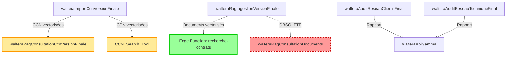

# Documentation Workflows n8n WALTERA

Ce dossier contient la documentation complète de tous les workflows n8n de l'application WALTERA.

> **⚠️ IMPORTANT - MIGRATION EN COURS** :
> L'agent conversationnel de recherche dans les documents clients (**walteraRagConsultationDocuments**) a été **migré vers Supabase Edge Function** (`recherche-contrats`) pour de meilleures performances (latence divisée par 2-5x).
>
> Les workflows **walteraRagConsultationCcnVersionFinale** (06) et **CCN_Search_Tool** (07) restent **actifs en production** pour la consultation des CCN et seront probablement les prochains à migrer.
>
> **➡️ Documentation Edge Functions** : [Edge Functions Supabase](../supabase/edge-functions/README.md)

---

## 📚 Table des Matières

| # | Workflow | Statut | Description | Documentation |
|---|----------|--------|-------------|---------------|
| 01 | **walteraRagIngestionVersionFinale** | ✅ Actif | Ingestion RAG depuis NAS Synology | [📄 Voir](./01-walteraRagIngestionVersionFinale.md) |
| 02 | **walteraApiGamma** | ✅ Actif | Intégration API Gamma pour présentations | [📄 Voir](./02-walteraApiGamma.md) |
| 03 | **walteraAuditReseauClientsFinal** | ✅ Actif | Audit arborescence clients | [📄 Voir](./03-walteraAuditReseauClientsFinal.md) |
| 04 | **walteraAuditReseauTechniqueFinal** | ✅ Actif | Audit technique infrastructure NAS | [📄 Voir](./04-walteraAuditReseauTechniqueFinal.md) |
| 05 | **walteraImportCcnVersionFinale** | ✅ Actif | Import CCN depuis Légifrance | [📄 Voir](./05-walteraImportCcnVersionFinale.md) |
| 06 | **walteraRagConsultationCcnVersionFinale** | ✅ Actif | Agent conversationnel CCN (Mistral) | [📄 Voir](./06-walteraRagConsultationCcnVersionFinale.md) |
| 07 | **CCN_Search_Tool** | ✅ Actif | Agent conversationnel CCN (OpenAI) | [📄 Voir](./07-CCN_Search_Tool.md) |
| 08 | **walteraRagConsultationDocuments** | ⚠️ Obsolète | Agent consultation documents - **REMPLACÉ PAR EDGE FUNCTION `recherche-contrats`** | [📄 Voir](./08-walteraRagConsultationDocuments.md) |
| 09 | **Import Catalogue CCN** | ⚠️ Inactif | Synchronisation catalogue complet CCN (650+) - **NÉCESSITE CORRECTIONS** | [📄 Voir](./09-ImportCatalogueCcn.md) |

---

## 🎯 Workflows par Catégorie

### 📥 Ingestion et Import
- **[walteraRagIngestionVersionFinale](./01-walteraRagIngestionVersionFinale.md)** : Ingestion automatique des documents depuis le NAS
- **[walteraImportCcnVersionFinale](./05-walteraImportCcnVersionFinale.md)** : Import des conventions collectives depuis Légifrance
- **[Import Catalogue CCN](./09-ImportCatalogueCcn.md)** : ⚠️ Synchronisation catalogue complet des 650+ CCN (inactif, nécessite corrections)

### 🔍 Consultation et RAG

**Workflows Actifs** :
- **[walteraRagConsultationCcnVersionFinale](./06-walteraRagConsultationCcnVersionFinale.md)** : Agent IA pour consultation CCN (Mistral Cloud) ✅
- **[CCN_Search_Tool](./07-CCN_Search_Tool.md)** : Agent IA pour consultation CCN (OpenAI) ✅

**Workflow Obsolète (migré vers Edge Functions)** :
- **walteraRagConsultationDocuments** : ⚠️ Remplacé par Edge Function `recherche-contrats` → [Documentation Edge Functions](../supabase/edge-functions/README.md)

### 📊 Audit et Analyse
- **[walteraAuditReseauClientsFinal](./03-walteraAuditReseauClientsFinal.md)** : Audit de l'arborescence clients
- **[walteraAuditReseauTechniqueFinal](./04-walteraAuditReseauTechniqueFinal.md)** : Audit technique du NAS

### 🎨 Génération de Contenu
- **[walteraApiGamma](./02-walteraApiGamma.md)** : Génération de présentations PowerPoint via Gamma

---

## 🔗 Dépendances entre Workflows



**Légende** :
- 🟢 **Edge Function** (nouvelle architecture, en production)
- 🟡 **Workflow actif** (candidat pour migration future)
- 🔴 **Workflow obsolète** (remplacé par Edge Function)

---

## 🚀 Démarrage Rapide

### 1. Ingestion de Documents
Pour indexer les documents du NAS :
```
Workflow : walteraRagIngestionVersionFinale
Trigger : Schedule (2h du matin) ou Manuel
```

### 2. Import de CCN
Pour importer des conventions collectives :
```bash
curl -X POST https://n8n.srv659987.hstgr.cloud/webhook/import-ccn \
  -H "Content-Type: application/json" \
  -d '{"idcc_list": ["1000", "1486"]}'
```

### 3. Consultation CCN
Pour poser une question sur une CCN :
```bash
curl -X POST https://n8n.srv659987.hstgr.cloud/webhook/8cb780f1-ec43-4e4a-8470-559c8b27081f \
  -H "Content-Type: application/json" \
  -d '{"chatInput": "Salaire minimum avocats ?"}'
```

### 4. Générer une Présentation
Pour créer une présentation Gamma :
```bash
curl -X POST https://n8n.srv659987.hstgr.cloud/webhook/promptGammaWaltera \
  -H "Content-Type: application/json" \
  -d '{"prompt": "Présentation sur la prévoyance collective"}'
```

---

## 📊 Architecture Globale

### Flux de Données

```
┌─────────────────────────────────────────────────────────────┐
│                     SOURCES DE DONNÉES                       │
├─────────────────────────────────────────────────────────────┤
│ • NAS Synology (Documents clients)                          │
│ • API Légifrance (Conventions collectives)                  │
└────────────────┬────────────────────────────────────────────┘
                 │
                 ▼
┌─────────────────────────────────────────────────────────────┐
│                   WORKFLOWS D'INGESTION                      │
├─────────────────────────────────────────────────────────────┤
│ • walteraRagIngestionVersionFinale                          │
│ • walteraImportCcnVersionFinale                             │
└────────────────┬────────────────────────────────────────────┘
                 │
                 ▼
┌─────────────────────────────────────────────────────────────┐
│              TRAITEMENT ET VECTORISATION                     │
├─────────────────────────────────────────────────────────────┤
│ • Apache Tika (Extraction texte)                            │
│ • Mistral Embeddings (Vectorisation)                        │
│ • Supabase Vector Store (Stockage)                          │
└────────────────┬────────────────────────────────────────────┘
                 │
                 ▼
┌─────────────────────────────────────────────────────────────┐
│         CONSULTATION (Workflows n8n + Edge Functions)        │
├─────────────────────────────────────────────────────────────┤
│ ✅ WORKFLOWS N8N ACTIFS (consultation CCN) :                │
│ • walteraRagConsultationCcnVersionFinale (Mistral Cloud)    │
│ • CCN_Search_Tool (OpenAI)                                  │
│                                                              │
│ ✅ EDGE FUNCTIONS (consultation documents clients) :        │
│ • recherche-contrats (Mistral Large + SSE streaming)        │
│                                                              │
│ ⚠️ WORKFLOW N8N OBSOLÈTE (remplacé par Edge Function) :     │
│ • walteraRagConsultationDocuments                           │
└────────────────┬────────────────────────────────────────────┘
                 │
                 ▼
┌─────────────────────────────────────────────────────────────┐
│                      UTILISATEURS                            │
├─────────────────────────────────────────────────────────────┤
│ • Interface Chat n8n                                        │
│ • Webhooks externes                                         │
│ • Application React (futur)                                 │
└─────────────────────────────────────────────────────────────┘
```

---

## 🔧 Stack Technique

### Orchestration
- **n8n** : Orchestration workflows
- **URL** : `https://n8n.srv659987.hstgr.cloud`

### LLM et Embeddings
- **Mistral AI** : `mistral-embed`, `mistral-small-latest`
- **OpenAI** : `gpt-4.1-mini`

### Base de Données
- **Supabase** : PostgreSQL + pgvector
- **Tables principales** : `documents`, `ccn`, `idcc_ref`, `chat_memory`

### Stockage
- **Synology NAS** : Documents sources
- **API** : SYNO.FileStation

### APIs Externes
- **Légifrance** : API PISTE (Conventions collectives)
- **Gamma** : Génération de présentations
- **Apache Tika** : Extraction de texte

---

## 📈 Métriques

### Volumétrie
- **Documents indexés** : ~10 000
- **CCN importées** : ~50 IDCC
- **Taille base vectorielle** : ~500 MB
- **Conversations/mois** : ~500

### Performance
- **Ingestion complète** : 2-3 heures
- **Import CCN** : 30-60 minutes
- **Temps de réponse RAG** : 2-5 secondes
- **Temps génération Gamma** : 30-60 secondes

---

## 🚨 Troubleshooting

### Ingestion bloquée
1. Vérifier l'authentification NAS Synology
2. Vérifier la disponibilité de Tika : `curl http://tika:9998/tika`
3. Vérifier les logs n8n : Interface > Executions

### Import CCN échoué
1. Vérifier le token OAuth Légifrance (renouvellement automatique)
2. Vérifier les quotas API Légifrance
3. Vérifier la table `idcc_ref` (IDCC actifs)

### Agent RAG ne répond pas
1. Vérifier les clés API (Mistral/OpenAI)
2. Vérifier la base vectorielle : `SELECT COUNT(*) FROM ccn;`
3. Vérifier la mémoire conversationnelle : `SELECT COUNT(*) FROM chat_memory;`

### Gamma timeout
1. Attendre plus longtemps (génération peut prendre 2-3 minutes)
2. Vérifier la clé API Gamma
3. Réduire le nombre de slides (`numCards`)

---

## 🔐 Sécurité

### Clés API à Externaliser
- ⚠️ **Mistral AI** : Actuellement hardcodée
- ⚠️ **OpenAI** : Actuellement hardcodée
- ⚠️ **Supabase Service Key** : Actuellement hardcodée
- ⚠️ **Gamma** : Actuellement hardcodée

### Recommandations
1. Migrer vers n8n Credentials
2. Rotation régulière des clés
3. Rate limiting sur les webhooks
4. Authentification sur les endpoints publics

---

## 🎯 Roadmap

### Q1 2026
- [ ] Migration clés API vers Credentials
- [ ] Dashboard de monitoring (Grafana)
- [ ] Tests automatisés (CI/CD)
- [ ] Documentation utilisateur finale

### Q2 2026
- [ ] API REST dédiée (hors n8n)
- [ ] Frontend React avec streaming
- [ ] Support multi-langues (EN, ES)
- [ ] Fine-tuning modèles sur données WALTERA

### Q3 2026
- [ ] Mobile app (React Native)
- [ ] Notifications push
- [ ] Export conversations en PDF
- [ ] Analytics avancées

---

## 📞 Support

### Contacts
- **Email** : jb@gared.fr
- **n8n** : `https://n8n.srv659987.hstgr.cloud`
- **Supabase** : `https://syxsacbciqwrahjdixuc.supabase.co`

### Ressources
- **n8n Docs** : https://docs.n8n.io
- **Supabase Docs** : https://supabase.com/docs
- **Mistral AI Docs** : https://docs.mistral.ai
- **OpenAI Docs** : https://platform.openai.com/docs
- **Légifrance API** : https://api.piste.gouv.fr/dila/legifrance/lf-engine-app/

---

## 📝 Contribuer

Pour ajouter ou modifier la documentation :

1. Cloner le repo : `git clone <repo>`
2. Créer une branche : `git checkout -b doc/nouveau-workflow`
3. Modifier/créer les fichiers dans `docs/n8n/`
4. Commit : `git commit -m "docs: ajout workflow X"`
5. Push : `git push origin doc/nouveau-workflow`
6. Créer une PR

---

## 📄 Licence

Documentation interne WALTERA - Tous droits réservés © 2025

---

**Dernière mise à jour** : 15 janvier 2026
**Maintenue par** : Équipe Tech WALTERA
